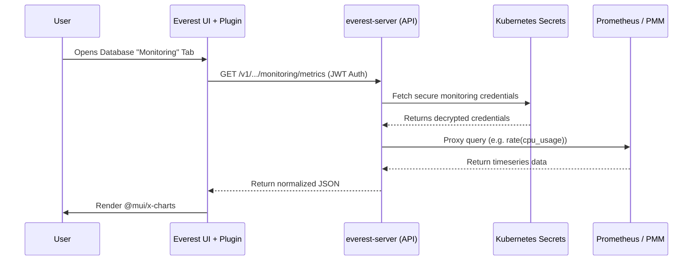
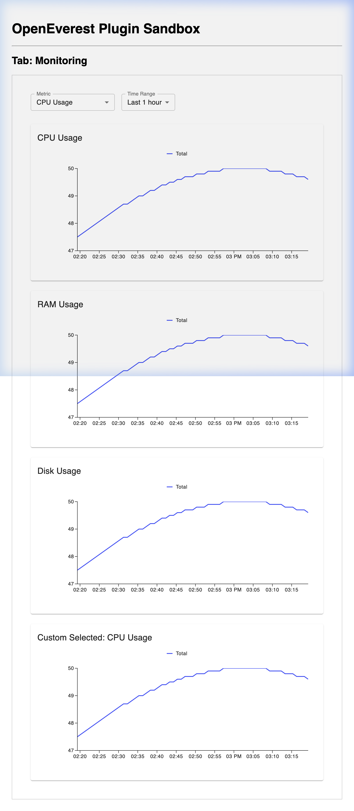

# OpenEverest Monitoring Plugin (PoC)

Welcome to the **Monitoring Plugin Proof of Concept** for OpenEverest! 

This plugin surfaces observability metrics (such as CPU, Memory, and Disk usage) directly inside the OpenEverest UI on the Database Cluster details page. This means users no longer have to leave the platform to monitor their workloads.

---

## Architecture Design: True Micro-Frontend

A major challenge with dynamic plugins in React applications is **Dependency Collision**. Because OpenEverest provides its own `React` instance at runtime, heavy third-party UI libraries like `@mui/material` and `@mui/x-charts` often crash when they try to use internal React hooks, because Vite bundles a conflicting private version of `react-dom` into the plugin.

### The Solution
This PoC implements a **flawless Micro-Frontend Architecture**:
1. The plugin bundles its *own* complete, isolated copies of `react` and `react-dom/client`.
2. The main OpenEverest UI only receives a "dummy wrapper" component from the plugin. 
3. When OpenEverest renders the dummy `<div>`, our plugin grabs a reference to it.
4. The plugin then uses its *own* isolated `ReactDOM.createRoot` to render the complex Material-UI charts inside that `<div>`.

This guarantees total isolation—the host React engine and the plugin React engine never interfere with each other!

### Backend Proxy Architecture
Instead of storing Prometheus API keys in the browser, the plugin securely queries `everest-server` via JWT authentication. The core OpenEverest API automatically retrieves the necessary credentials from Kubernetes Secrets and proxies the request to Prometheus/PMM.

### Architecture Diagram



---

## Developer Guide: How to Test Locally

You can test this plugin directly against a local running instance of OpenEverest (`make dev-up`).

### 1. Build the Frontend Plugin
The plugin UI must be compiled using Vite into ES Modules.
```bash
npm install
npm run build
```

### 2. Copy the Frontend Build to the Backend
The Go backend (`mock-server`) embeds the compiled UI files so they can be served over HTTP.
```bash
# Ensure the dist/ directory exists in the backend
mkdir -p backend/public/dist backend/dist

# Copy the built chunks from the frontend to the backend
cp -r dist/* backend/public/dist/
cp -r dist/* backend/dist/
```

### 3. Build and Start the Mock Server
The `mock-server` simulates the backend proxy by serving the plugin JavaScript bundle and returning dummy Prometheus metrics.
```bash
cd backend
go build -o mock-server .
PORT=8081 ./mock-server
```

### 4. Create a Dummy Database Cluster (Optional)
If you don't have a real database provisioned, you can inject a dummy cluster into Kubernetes so the OpenEverest UI displays the details page:

```bash
kubectl apply -f - <<EOF
apiVersion: everest.percona.com/v1alpha1
kind: DatabaseCluster
metadata:
  name: test-db-cluster
  namespace: my-special-place
spec:
  engine:
    type: psmdb
    version: 6.0.4
    replicas: 1
    storage:
      size: 1Gi
  proxy:
    type: mongos
    replicas: 1
    expose:
      type: ClusterIP
EOF

# Patch the status to trick the UI into thinking it is "Ready"
kubectl patch databasecluster test-db-cluster -n my-special-place \
  --type=merge \
  --subresource status \
  -p '{"status": {"status": "ready", "ready": 1, "size": 1, "hostname": "dummy-host", "port": 27017}}'
```

### 5. Register the Plugin
Apply the Plugin Custom Resource to your cluster. This tells OpenEverest where to download the plugin bundle (`main.js`).

```bash
kubectl apply -f test-plugin.yaml
```
*Note: The `test-plugin.yaml` should point its `bundleUrl` to the address of your locally running `mock-server`.*

### 6. Bypassing the Browser Cache (Development)
Browsers aggressively cache ES Module dynamic imports (`import()`). If you make changes to the plugin frontend and rebuild it, you must append a cache-busting version parameter to the Plugin CR to force the browser to fetch the new code.

```bash
kubectl patch plugin monitoring-plugin -n everest-system --type=merge -p '{"spec":{"frontend":{"bundlePath":"main.js?v=2"}}}'
```
*(Increment `v=2` to `v=3`, etc., every time you deploy a new build).*

---

## Features
- **Native UI Integration**: Injects a seamless "Monitoring" tab into the database cluster details page.
- **Isolated CSS Grid**: Uses native CSS Grid to arrange charts dynamically, bypassing global Material-UI layout dependencies.
- **Interactive Charts**: Responsive time-series graphs powered by `@mui/x-charts`.
- **Metric Dropdowns**: Allows users to select between CPU, Memory, and Disk usage metrics.
- **Zero-Config Security**: Bypasses CORS and authenticates seamlessly via OpenEverest's `api.fetch()`.

---

## Screenshots



> *The plugin rendering metrics beautifully inside a 2x2 CSS Grid, fully isolated from the host theme.*

---

## Repository Structure

- `src/main.tsx` - The main entrypoint for the frontend plugin. Registers the `clusterDetailTab` extension.
- `src/MonitoringTab.tsx` - The actual monitoring React components utilizing the private isolated React engine.
- `src/sandbox.tsx` - A mock OpenEverest plugin host for local UI testing.
- `backend/` - A boilerplate Go file server that serves the compiled UI bundle and implements a mock Prometheus metrics proxy.
- `vite.config.ts` - Vite configuration optimized for building ES modules and chunk splitting.
