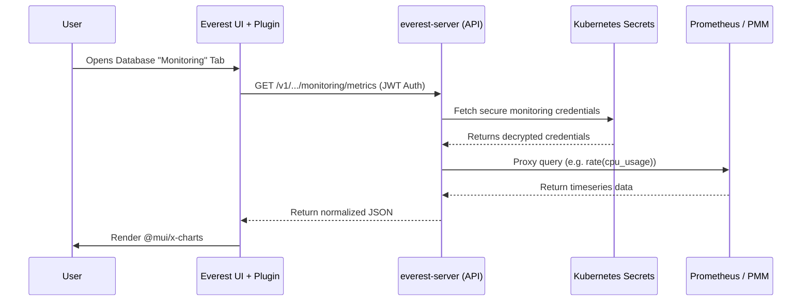

# OpenEverest Monitoring Plugin (PoC)

Welcome to the **Monitoring Plugin Proof of Concept** for OpenEverest! 

This plugin surfaces observability metrics (such as CPU, Memory, and Disk usage) directly inside the OpenEverest UI on the Database Cluster details page, meaning users no longer have to leave the platform to monitor their workloads.

##  Features (PoC Scope)
- **Native UI Integration**: Injects a seamless "Monitoring" tab into the database cluster details page.
- **Interactive Charts**: Uses `@mui/x-charts` for beautiful, responsive time-series graphs.
- **Metric Dropdowns**: Allows users to select between CPU, Memory, and Disk usage metrics.
- **Zero-Config Security**: Bypasses CORS and securely authenticates with Prometheus/PMM without storing credentials in the browser.

---

##  Architecture Design

A core architectural decision for this PoC was to keep the heavy lifting inside the core OpenEverest API, rather than inside the plugin's own backend. 

### Why proxy through `everest-server` instead of the plugin backend?
1. **Security (Least Privilege):** The main `everest-server` already possesses the necessary RBAC permissions and built-in logic to securely read monitoring credentials (like API keys) from Kubernetes Secrets. Putting the proxy in the plugin would require elevating the plugin's RBAC permissions to read core cluster secrets, which is a security risk.
2. **Reusability:** By exposing the endpoint (`GET /v1/namespaces/{namespace}/database-clusters/{name}/monitoring/metrics`) on the core API, metrics become a first-class citizen. Future CLI tools or native features can use this endpoint instantly.
3. **Authentication:** The main server automatically handles JWT validation.

### Architecture Diagram



---

##  Screenshots

*(Maintainer note: Add screenshots of the UI rendering here before merging)*


> *The plugin rendering metrics natively via the sandbox environment.*

---

##  Local Development (Sandbox)

Because the generic plugin architecture is not fully merged into the core OpenEverest UI yet, this repository includes a **local sandbox** that mocks the OpenEverest plugin host.

To run the sandbox locally and test the UI:

1. Install dependencies:
   ```bash
   npm install
   ```
2. Start the development server (runs on `localhost:3003` by default):
   ```bash
   npm run dev
   ```
3. Open `http://localhost:3003` in your browser to interact with the plugin UI!

*(Note: The sandbox relies on a locally running instance of `everest-server` with the monitoring proxy endpoint implemented to fetch real data).*

---

## 📁 Repository Structure

- `src/main.tsx` - The main entrypoint for the frontend plugin. Registers the `clusterDetailTab` extension.
- `src/sandbox.tsx` - A mock OpenEverest plugin host for local UI testing.
- `backend/` - A boilerplate Go file server that serves the compiled UI bundle.
- `vite.config.ts` - Vite configuration optimized for building ES modules.
