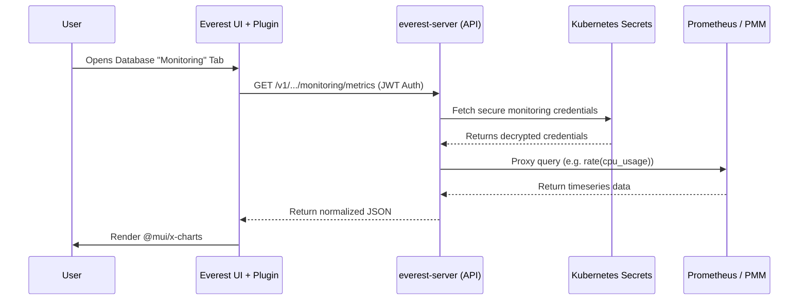

# OpenEverest Monitoring Plugin (PoC)

Welcome to the **Monitoring Plugin Proof of Concept** for OpenEverest! 

This plugin surfaces observability metrics (such as CPU, Memory, and Disk usage) directly inside the OpenEverest UI on the Database Cluster details page. This means users no longer have to leave the platform to monitor their workloads.

---

## Quick Start Guide

To see the plugin and its interactive charts in action right now, we have provided a **Local Sandbox**. Because the main OpenEverest UI does not yet support dynamically loading generic plugins on this branch, the Sandbox provides a mocked plugin host so you can test the UI in isolation.

### Step 1: Prerequisites
This plugin relies on the **main OpenEverest API backend** (`everest-server`) to proxy requests to Prometheus/PMM securely. 
Ensure you have your local OpenEverest backend running (e.g., via `make dev-up`).

### Step 2: Start the Plugin Sandbox
Open your terminal in this plugin repository and install the dependencies:
```bash
npm install
```
Then, start the development server:
```bash
npm run dev
```

### Step 3: View the Charts
The sandbox will start a local dev server (usually on `http://localhost:3001` or `3003`). 
Open that URL in your browser. You will see a mocked OpenEverest interface displaying the new **Monitoring** tab, complete with interactive `@mui/x-charts` and metric dropdowns!

---

## Features (PoC Scope)
- **Native UI Integration**: Injects a seamless "Monitoring" tab into the database cluster details page.
- **Interactive Charts**: Uses `@mui/x-charts` for beautiful, responsive time-series graphs.
- **Metric Dropdowns**: Allows users to select between CPU, Memory, and Disk usage metrics.
- **Zero-Config Security**: Bypasses CORS and securely authenticates with Prometheus/PMM without storing credentials in the browser.

---

## Architecture Design

A core architectural decision for this PoC was to keep the heavy lifting inside the core OpenEverest API, rather than inside the plugin's own backend. 

### Why proxy through `everest-server` instead of the plugin backend?
1. **Security (Least Privilege):** The main `everest-server` already possesses the necessary RBAC permissions and built-in logic to securely read monitoring credentials (like API keys) from Kubernetes Secrets. Putting the proxy in the plugin would require elevating the plugin's RBAC permissions to read core cluster secrets, which is a security risk.
2. **Reusability:** By exposing the endpoint (`GET /v1/namespaces/{namespace}/database-clusters/{name}/monitoring/metrics`) on the core API, metrics become a first-class citizen. Future CLI tools or native features can use this endpoint instantly.
3. **Authentication:** The main server automatically handles JWT validation.

### Architecture Diagram



---

## Screenshots

*(Maintainer note: Add screenshots of the UI rendering here before merging)*


> *The plugin rendering metrics natively via the sandbox environment.*

---

## Repository Structure

- `src/main.tsx` - The main entrypoint for the frontend plugin. Registers the `clusterDetailTab` extension.
- `src/sandbox.tsx` - A mock OpenEverest plugin host for local UI testing.
- `backend/` - A boilerplate Go file server that serves the compiled UI bundle (currently untouched for this PoC).
- `vite.config.ts` - Vite configuration optimized for building ES modules.
